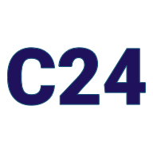
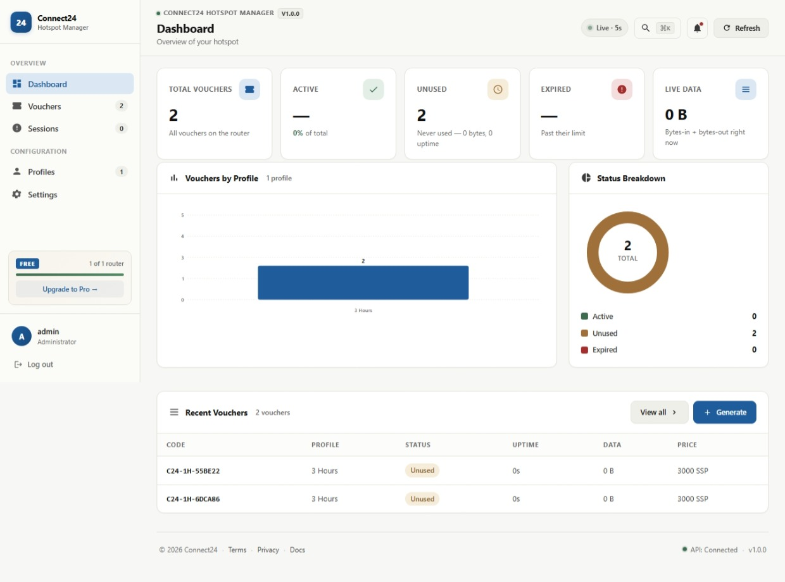
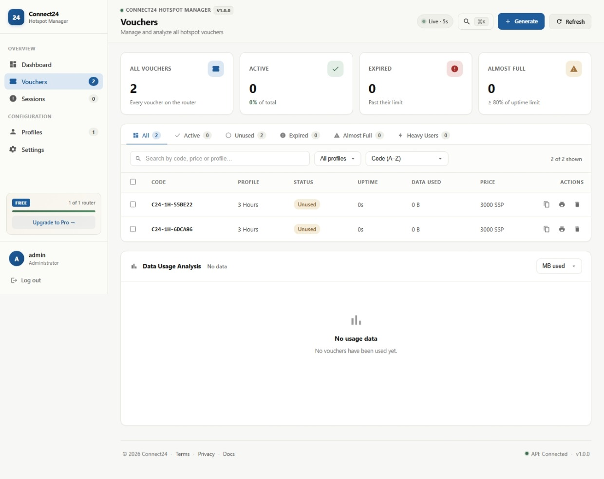
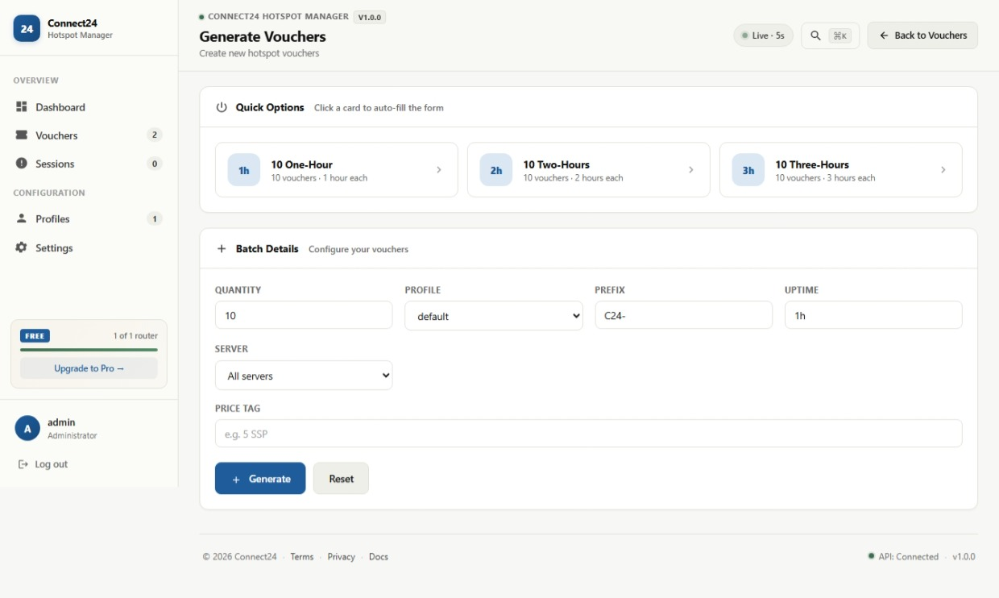
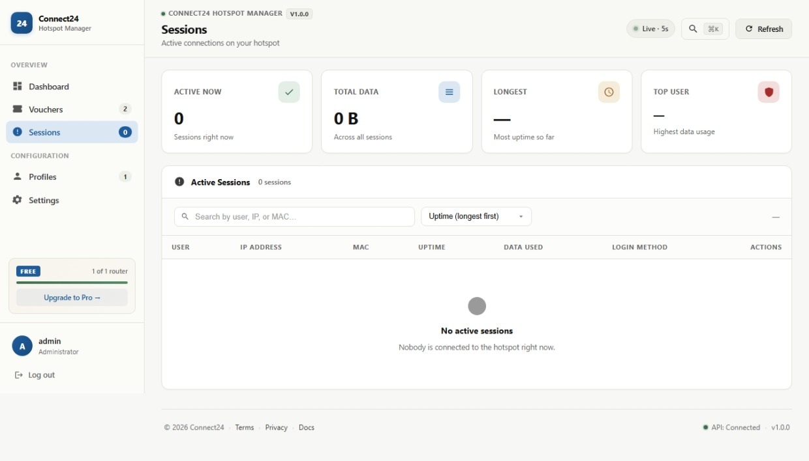
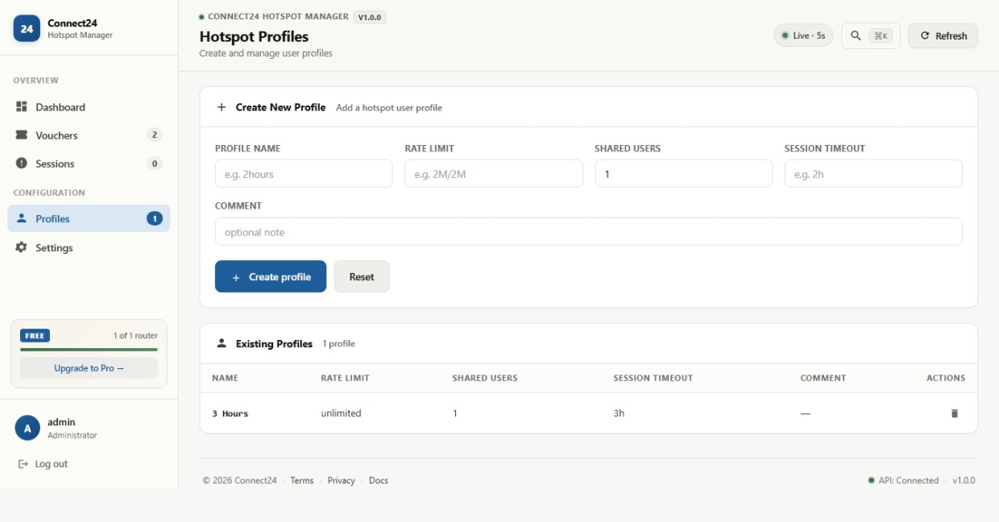
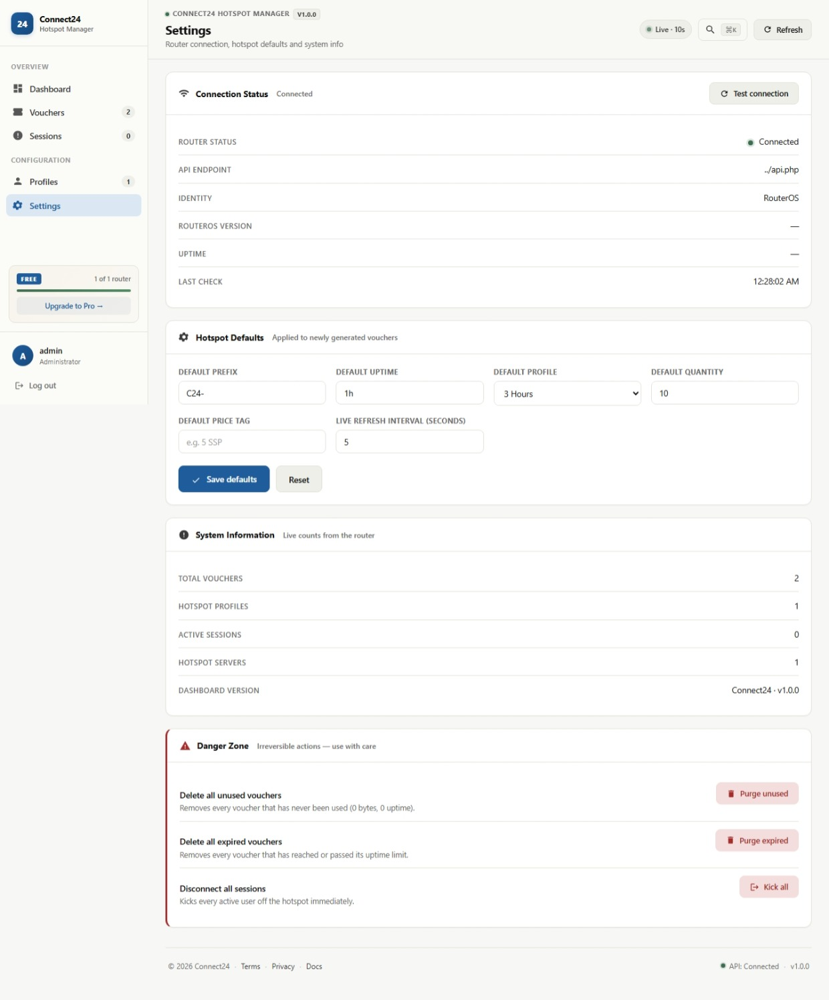

<div align="center">



# Connect24 Hotspot Manager

**MikroTik Hotspot Billing & Voucher Platform**

A self-hosted admin panel for MikroTik hotspot operators. Generate voucher
batches, track live sessions, manage user profiles, and purge expired
vouchers — all from one clean, keyboard-first dashboard.

[](CHANGELOG.md)
[](LICENSE)
[](https://www.php.net/)
[](https://mikrotik.com/)
[]()
[](https://github.com/godwillkenyi/Connect24-Hotspot-Manager/actions/workflows/lint.yml)
[](CONTRIBUTING.md)

[Features](#features) · [Screenshots](#screenshots) · [Quick start](#quick-start) · [Docs](docs/) · [Demo](#demo-mode) · [License](#license)

</div>

---

## What is Connect24?

Connect24 is a **zero-dependency** admin panel for MikroTik hotspot
operators. It talks directly to the RouterOS API — no database, no
build step, no npm. Point PHP at the `public/` folder and you're running.

It replaces the daily pain of Winbox for hotspot management:

- **Voucher generation** — one click, any quantity, any profile
- **Live dashboard** — real-time stats, charts, session bytes
- **Session control** — see who's online, kick individuals or everyone
- **Profile management** — rate limits, timeouts, shared users
- **Print & export** — printable cards and CSV in one click

Built for hotspot operators who want a modern interface without
sacrificing the reliability of RouterOS underneath.

---

## Screenshots

### Dashboard — real-time overview



### Vouchers — manage, filter, export



### Generate — batch creation with live preview



### Sessions — live user monitoring



### Profiles — hotspot configuration



### Settings — system info and danger zone



---

## Features

### 🎟️ Voucher management

- Generate batches of 1–100 vouchers in a single click
- Custom prefix, profile, uptime, price tag, and server
- Print as branded cards (3-up layout, print-ready)
- Export any selection to CSV
- Bulk delete, bulk print, bulk export
- Copy individual codes with one click
- Six filtered views: All · Active · Unused · Expired · Almost Full · Heavy Users
- Live search across code, profile, and price
- Sortable by code, uptime, or data usage

### 📊 Live dashboard

- Animated stat cards (total / active / unused / expired)
- Real-time bandwidth tracking (bytes-in + bytes-out)
- Bar chart — vouchers by profile
- Donut chart — status breakdown
- Recent vouchers table
- Auto-refreshes every 2–3 seconds

### 👥 Session monitoring

- Live list of every connected user
- IP address, MAC, uptime, and data usage per session
- Per-session disconnect with confirmation
- Disconnect-all for firmware updates or firewall changes
- Search by user, IP, or MAC
- 6-way sort (uptime, bytes, user — both directions)
- Live stat cards (active count, total data, longest session, top user)

### ⚙️ Profile management

- Create profiles with rate limit, shared users, and session timeout
- System profiles (`default`, `none`) automatically hidden
- Delete profiles with confirmation
- Dropdown integration on the Generate page

### 🎨 Design

- **Zero dependencies** — pure vanilla JS + PHP, no framework
- **Dark mode** — automatic OS detection + manual toggle
- **Keyboard-first** — ⌘K command palette, `g`-shortcuts, full tab nav
- **Responsive** — mobile sidebar, breakpoint-aware charts
- **Accessible** — `:focus-visible` rings, `aria-label` on every icon button
- **PWA-ready** — installable as a standalone app
- **Branded error pages** — 404 and 500 look intentional, not broken

---

## Quick start

### 1. Get the code

```bash
git clone https://github.com/godwillkenyi/Connect24-Hotspot-Manager.git
cd connect24
```

### 2. Configure

```bash 
cp .env.example .env
```
Edit `.env` and set your router credentials:

```env
ROUTER_HOST=192.168.88.1
ROUTER_USER=connect24
ROUTER_PASS=your-secure-password
ROUTER_PORT=443
ROUTER_TLS=true

APP_URL=http://localhost:8080
SESSION_SECRET=your-64-char-random-string
ADMIN_USER=admin
ADMIN_PASS=change-this-immediately
```

Generate a secure `SESSION_SECRET`:

```bash
php -r "echo bin2hex(random_bytes(32));"
```

### 3. Run it

For a quick local test:

```bash
php -S localhost:8080 -t public
```

Open <http://localhost:8080>. Done.

For production, point Apache/Nginx/Caddy at the `public/` folder. Full
walkthrough in [docs/install.md](docs/install.md).

### 4. Create the RouterOS API user

On your router (Winbox or SSH):

```
/user group add name=connect24 policy=read,write,api,rest-api
/user add name=connect24 group=connect24 password=your-secure-password
/ip service enable www-ssl
```

Full walkthrough including TLS and firewall hardening in
[docs/router-setup.md](docs/router-setup.md).

---

## Demo mode

Don't have a router handy? Preview the entire app with sample data:

```
http://localhost:8080/pages/dashboard.html?demo=1
```

Everything works — stats, charts, voucher generation, session list,
profiles — but nothing touches a real router. A blue banner appears at
the top to remind you.

This is the fastest way to:

- **Take screenshots** for the README
- **Show the app** to a client or colleague
- **Learn the interface** before going live
- **Develop against the UI** without a router on your desk

Every API call is intercepted and served from `api.php`'s demo branch.

---

## Requirements

| Component | Minimum | Recommended |
|---|---|---|
| PHP | 8.0 | 8.2+ |
| Web server | Apache, Nginx, Caddy, or PHP built-in | Nginx or Caddy |
| MikroTik RouterOS | 6.48 | 7.x |
| Database | **None** | **None** |
| Browser | Chrome 100+, Firefox 100+, Safari 15+ | Latest |

---

## Configuration reference

All configuration lives in `.env`:

| Variable | Default | Description |
|---|---|---|
| `ROUTER_HOST` | `192.168.88.1` | Router IP or hostname |
| `ROUTER_USER` | `connect24` | API username |
| `ROUTER_PASS` | — | API password |
| `ROUTER_PORT` | `443` | API port |
| `ROUTER_TLS` | `true` | Use HTTPS to the router |
| `APP_NAME` | `Connect24` | Brand name shown in UI |
| `APP_URL` | `http://localhost:8080` | Public URL |
| `APP_ENV` | `production` | `production` or `development` |
| `APP_DEBUG` | `false` | Verbose error output |
| `SESSION_LIFETIME` | `3600` | Admin session TTL (seconds) |
| `SESSION_SECRET` | — | Random string for session signing |
| `ADMIN_USER` | `admin` | Admin login username |
| `ADMIN_PASS` | — | Admin login password |
| `DEMO_MODE` | `false` | Force demo mode globally |

---

## Project structure

```
connect24/
├── README.md
├── LICENSE
├── CHANGELOG.md
├── CONTRIBUTING.md
├── SECURITY.md
├── .env.example
├── .gitignore
│
├── .github/
│   ├── ISSUE_TEMPLATE/
│   ├── PULL_REQUEST_TEMPLATE.md
│   ├── FUNDING.yml
│   └── workflows/lint.yml
│
├── docs/
│   ├── README.md               (docs index)
│   ├── install.md              (setup walkthrough)
│   ├── router-setup.md         (MikroTik API guide)
│   ├── faq.md                  (50+ Q&A)
│   ├── security.md             (threat model)
│   └── screenshots/            (6 PNGs)
│
└── public/
    ├── index.html              (login)
    ├── logout.html
    ├── 404.html
    ├── 500.html
    ├── manifest.json           (PWA)
    ├── robots.txt
    ├── favicon.ico
    ├── favicon-32.png
    ├── favicon-192.png
    ├── favicon-512.png
    ├── apple-touch-icon.png
    ├── shared.css              (design tokens + components)
    ├── shared.js               (appApi + hooks + Tiers 1–3)
    ├── api.php                 (RouterOS REST proxy)
    └── pages/
        ├── dashboard.html
        ├── vouchers.html
        ├── generate.html
        ├── sessions.html
        ├── profiles.html
        └── settings.html
```

---

## Keyboard shortcuts

| Shortcut | Action |
|---|---|
| `⌘K` / `Ctrl+K` | Open command palette |
| `g` then `d` | Go to Dashboard |
| `g` then `v` | Go to Vouchers |
| `g` then `s` | Go to Sessions |
| `g` then `p` | Go to Profiles |
| `g` then `g` | Go to Generate |
| `g` then `,` | Go to Settings |
| `Esc` | Close any modal |
| `↑` `↓` | Navigate command palette |
| `Enter` | Open selected item |

---

## Security

Connect24 is built with a **least-privilege** model:

- Router credentials stored in `.env` (never committed, never in the browser)
- API user has only `read,write,api,rest-api` — no admin access
- Session-based auth with signed cookies
- `SameSite=Lax` cookies block cross-site POSTs
- No telemetry, no analytics, no third-party calls

Full threat model and hardening guide in
[docs/security.md](docs/security.md).

**Found a security issue?** Please **do not** open a public GitHub
issue. Email **testapps065@gmail.com** instead. See
[SECURITY.md](SECURITY.md) for details.

---

## Roadmap

- [x] **v1.0.0** — Initial release
  - Full voucher lifecycle management
  - Live session monitoring
  - Profile CRUD
  - Dark mode, ⌘K, PWA
- [ ] **v1.1.0** — Edit vouchers, CSRF tokens, MFA
- [ ] **v1.2.0** — Reseller accounts, billing integration
- [ ] **v2.0.0** — Multi-tenant, white-label

See [CHANGELOG.md](CHANGELOG.md) for the full history.

---

## Contributing

Contributions are welcome. See [CONTRIBUTING.md](CONTRIBUTING.md) for
guidelines on:

- Reporting bugs
- Requesting features
- Submitting pull requests
- The style guide
- The commit message format

**Quick rules:**

- No new dependencies (the project is intentionally zero-dependency)
- One feature per PR
- Update `CHANGELOG.md` under `[Unreleased]`
- Test with `?demo=1` and, if possible, a real router

---

## License

Commercial. **Free for personal use on a single MikroTik router.**

Use on more than one router, or as a hosted service for third parties,
requires a paid Pro license. See [LICENSE](LICENSE) for the full terms.

| Tier | Scope | Price |
|---|---|---|
| **Free** | 1 router, personal use | $0 |
| **Pro** | Unlimited routers, commercial | [Contact me](mailto:testapps065@gmail.com?subject=Connect24%20Pro%20License) |
| **White-Label** | Rebrand and redistribute | [Contact me](mailto:testapps065@gmail.com?subject=Connect24%20White-Label%20License) |

---

## Author

**Godwill Kenyi** — creator and maintainer

- 🐙 GitHub: [@godwillkenyi](https://github.com/godwillkenyi)
- 📧 Email: testapps065@gmail.com
- 📍 Location: South Sudan

## Support

- 📖 **Documentation:** [docs/](docs/)
- 🐛 **Bug reports:** [GitHub Issues](https://github.com/godwillkenyi/Connect24-Hotspot-Manager/issues)
- 💬 **Questions & ideas:** [GitHub Discussions](https://github.com/godwillkenyi/Connect24-Hotspot-Manager/discussions)
- 📧 **Direct email:** testapps065@gmail.com
- 🔒 **Security disclosure:** testapps065@gmail.com (do **not** use the issue tracker for security issues)
- 💼 **Commercial licensing:** testapps065@gmail.com

---

## Acknowledgements

- Inspired by the daily work of hotspot operators everywhere
- Not affiliated with or endorsed by MikroTik SIA
- Built with plain HTML, CSS, and JavaScript — no framework, by design

---

<div align="center">
  <sub>Built with ❤️ by <a href="https://github.com/godwillkenyi">Godwill Kenyi</a> for the MikroTik community</sub>

  <br><br>

  <a href="#top">↑ Back to top</a>
</div>